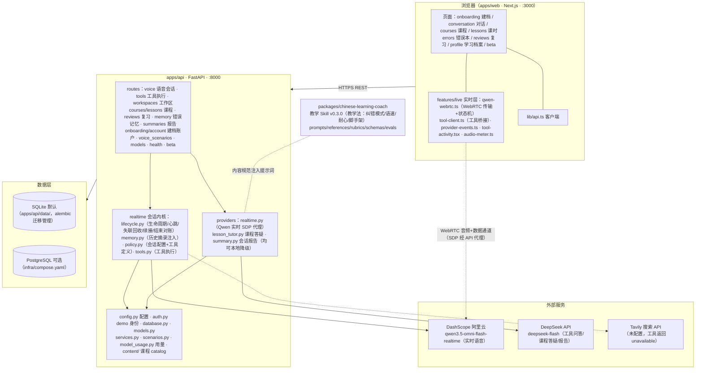
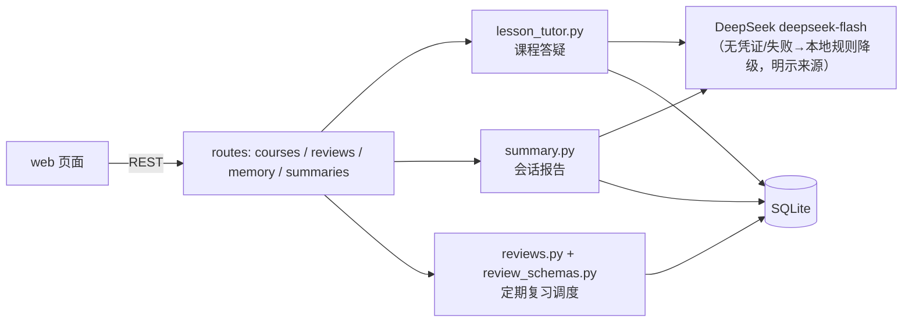

# HanziMate 当前整体框架图（2026-09-18）

反映代码当前实际状态（非规划状态）。数据模型细节见 [ERD.md](./ERD.md)，实时语音设计见 [realtime-voice-live-design.md](./realtime-voice-live-design.md)。

## 1. 总体分层

## 2. 实时语音通话数据流（核心链路）

```mermaid
sequenceDiagram
    participant U as 浏览器 features/live
    participant API as FastAPI routes/voice.py
    participant RT as realtime 内核
    participant DS as DashScope qwen-omni
    participant DB as SQLite

    U->>API: 创建会话（幂等，continuous=true）
    API->>DB: 会话+配置入库
    U->>API: POST SDP offer（voice.py）
    API->>DS: 代理转发 SDP
    DS-->>U: SDP answer → ICE/DTLS → DataChannel 开启
    U->>DS: session.update（policy.py 生成：工具定义+教学配置+记忆摘录）
    DS-->>U: session.updated（工具被确认接受）
    Note over U,DS: 双向音频流 + 数据通道事件（字幕 delta/done、VAD、response.*）
    U->>API: 可靠终稿转写入库（partial 不入库）

    rect rgb(40, 44, 52)
    Note over U,DB: 工具调用闭环（真实供应商已验证）
    DS-->>U: response.function_call_arguments.done
    U->>API: POST /tools/execute（代次/归属/预算校验）
    API->>RT: tools.py：hsk_lookup 本地 / web_search Tavily / expert_answer DeepSeek
    RT-->>U: 结果 + 来源
    U->>DS: function_call_output → response.create（插话/取消/迟到结果隔离）
    end

    loop 连续会话（每 1500s 一段）
        RT->>RT: 空闲检测 → 排空 → 换连接续接（epoch+1，静音选择保持）
    end
    U->>API: 结束：清单排空 → finalize 对账 → Markdown 导出
    API->>DB: completed + 会话报告（summary.py）
```

## 3. 异步教学链路

## 4. 组件-代码对照表

| 层 | 组件 | 代码位置 |
|---|---|---|
| Web | 对话页（实时通话编排） | `apps/web/app/conversation/[workspaceId]/page.tsx` |
| Web | WebRTC 传输 + 状态机 + 文字插话栅栏 | `apps/web/features/live/qwen-webrtc.ts` |
| Web | 工具桥接（去重/取消/迟到隔离） | `apps/web/features/live/tool-client.ts` |
| Web | 工具活动面板 | `apps/web/features/live/tool-activity.tsx` |
| API | 语音会话 REST + SDP 代理 + 转写持久化 | `apps/api/app/routes/voice.py` |
| API | 工具执行/取消/预算 | `apps/api/app/routes/tools.py` + `realtime/tools.py` |
| API | 会话生命周期（心跳/失联回收/续接/结束对账） | `apps/api/app/realtime/lifecycle.py` |
| API | 历史摘录（12000 字符署名摘录+早期锚点） | `apps/api/app/realtime/memory.py` |
| API | 会话配置与工具定义注入 | `apps/api/app/realtime/policy.py` |
| API | 课程答疑 / 会话报告（DeepSeek 或本地降级） | `apps/api/app/providers/{lesson_tutor,summary}.py` |
| 数据 | SQLite + alembic 迁移 | `apps/api/data/`、`apps/api/alembic/` |
| 教学法 | 教学 Skill（prompts/rubrics/evals） | `packages/chinese-learning-coach/` |
| 部署 | PostgreSQL 可选编排 | `infra/compose.yaml` |

## 5. 当前状态标注

- 实时语音（DashScope）、工具三件套（hsk_lookup/web_search/expert_answer）、连续会话续接与记忆：已实现并通过统一验收（2026-09-17/18），真实供应商链路复验通过。
- Tavily 未配置：`web_search` 明确返回 unavailable（预期行为）。
- demo 身份机制（auth.py）：公开部署前需接正式认证。
- 待立项：HSK 考纲知识库（计划见 [hsk-knowledge-base-plan.md](./hsk-knowledge-base-plan.md)），落地后 `hsk_lookup` 数据源从课程 catalog 切到考纲 KB。
- 真人语音听感验收（G1–G7）进行中，见 [../../BLOCKERS.md](../../BLOCKERS.md)。
