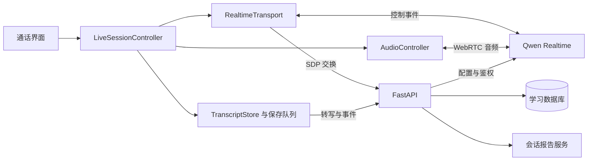
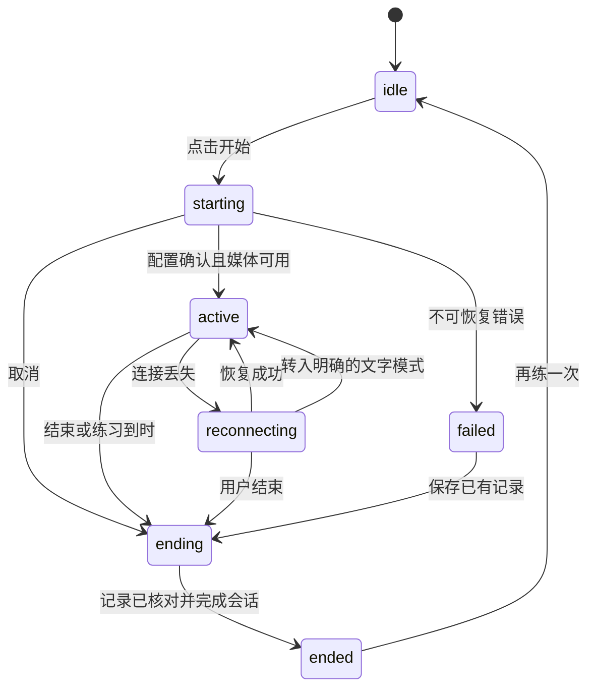
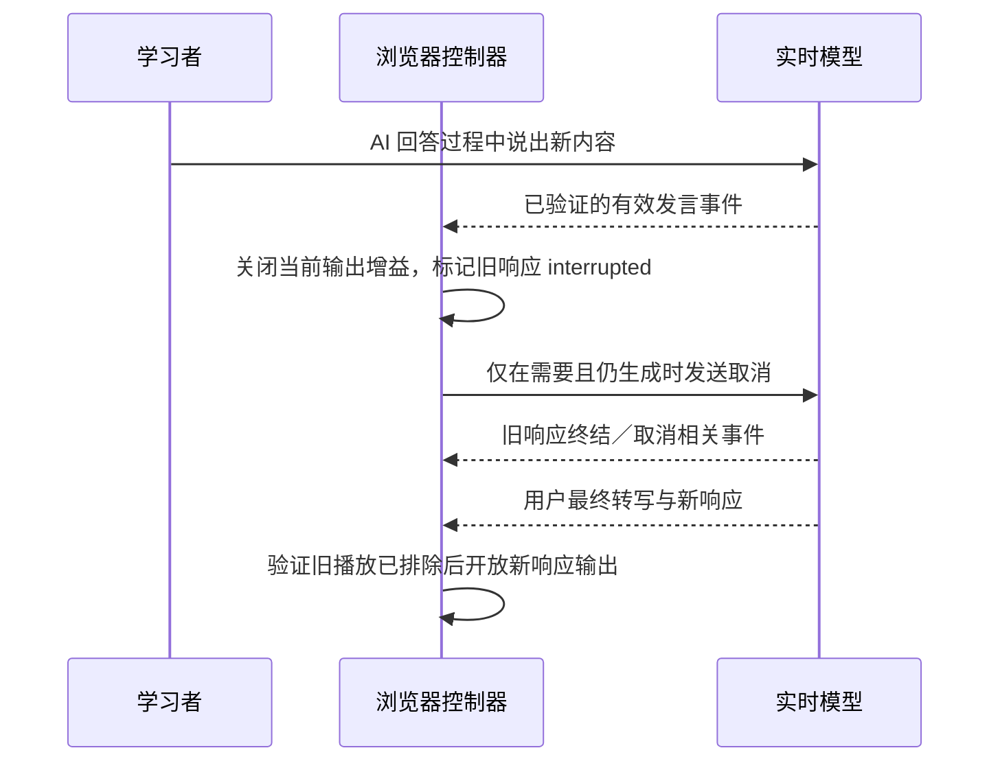

# HanziMate Live 实时语音交互开发技术设计书

版本：0.1.0  
日期：2026-09-05  
状态：Live v1 基础实现已交付；真实 Qwen 通话与真机指标仍待凭证环境验收。  
适用范围：现有 HanziMate Web MVP 的场景对话模块。  
交互参考：ChatGPT Live 的持续语音交流、自然插话、同步文字和简洁通话控制。

## 1. 设计结论

保留 Next.js、FastAPI、SQLAlchemy 与 Qwen WebRTC 接入方向，在现有系统中实现 HanziMate Live。第一版以“一次点击开始、持续交流、可以插话、字幕可追溯、结束后形成学习报告”为闭环。

核心改造有四项：

1. 将当前对话大页面拆成通话控制器、传输适配器、音频播放器、转写存储与展示组件。
2. 使用经过验证的语义轮次判断，适应中文学习者的慢速表达、犹豫和自我修正。
3. 对打断、断线、结束、迟到事件和重复事件建立明确规则，使音频、界面与记录保持一致。
4. 用真实通话数据验收体验，独立记录模型生成、音频播放、转写保存的状态。

本设计承诺可开发的交互形式，不承诺与 ChatGPT 使用相同模型、音色或相同的重叠语音理解能力。GPT Live 在本项目中是交互参照。

第一发布目标是桌面 Chrome、Edge 的真实语音闭环；Safari、手机浏览器作为后续兼容阶段。浏览器版本与设备型号必须随验收记录保存。

## 2. 范围与交互合同

### 2.1 第一版必须交付

| 编号 | 用户可感知行为 | 实现边界 |
|---|---|---|
| UX-01 | 选择场景后点击开始，授权麦克风即可交流 | 开始过程可取消，重复点击不创建重复会话 |
| UX-02 | 不用每句话点发送，AI 自动接话 | 默认面向学习者的耐心等待档位 |
| UX-03 | AI 说话时开口插话，AI 停下来听 | 区分有效插话与附和音；停止旧播放并正确接续 |
| UX-04 | 当前字幕随交流更新，完整记录可以展开 | 流式草稿允许修正；不承诺逐字卡拉 OK 对齐 |
| UX-05 | 静音后 AI 听不到新话，仍可听 AI 回答 | 静音与停止 AI 播放是两个操作 |
| UX-06 | 可用文字补充，也能结束当前回答 | 文字与语音进入同一教学上下文 |
| UX-07 | 选择慢速、沉浸／教练／考试模式 | 设置实际进入模型指令；显示生效状态 |
| UX-08 | 短暂断网后明确提示并尝试恢复 | 保留已确认记录；恢复不了可转文字或结束 |
| UX-09 | 点击结束后立即停止收音和播放 | 保存过程与报告过程分开，保存失败不显示“全部已保存” |
| UX-10 | 结束后查看反馈并决定是否记住错误 | 只有可靠的学习者最终转写进入错误候选分析 |

语音说“慢一点”“再说一遍”属于首版真实体验验收。模型可以直接遵循这类口头要求，但没有结构化确认时，不据此自动修改界面上的持久语速设置；界面设置由明确的设置操作更新。

### 2.2 后续阶段

- 超过 8 分钟的连续训练、滚动摘要和会话衔接。
- 手机与 Safari 的完整兼容、输入设备切换、后台恢复。
- 独立的真实文本导师降级服务。
- 通话中的结构化教学提示卡，以及可靠的语音指令与设置同步。
- 供应商事件服务端观测、可验证的费用硬限制和公网运行保护。

摄像头、屏幕共享、实时看图、联网搜索、通话中执行外部任务、专业发音评分、多人同聊不属于本次开发范围。

### 2.3 通话界面

沿用项目纸张色、中性深色与绿色／琥珀色视觉体系。进入通话后折叠课程式侧栏，突出交流本身。

```text
┌──────────────────────────────────────────────┐
│ ← 返回       食堂点餐          03:24  连接正常 │
│                                              │
│                  动态音球                     │
│                正在听你说                     │
│                                              │
│ 小文：你想在这里吃，还是打包带走？             │
│ 你：我想……打包。                              │
│                                              │
│      [展开记录]     [本次目标与设置]            │
│                                              │
│   [静音] [停止回答] [文字输入] [结束对话]        │
└──────────────────────────────────────────────┘
```

- 通话前：场景、目标、纠错模式、语速、麦克风检查；检查完成后复用音轨，取消即释放。
- 通话中：音球反映实际输入／输出能量；“正在理解”使用独立动画，不能假装有声音。
- 完整转写在抽屉展开，用户主动向上阅读时停止自动滚动，并提示有新内容。
- 语速和等待耐心可在设置中调整；纠错模式在首版会话开始时固定，下一次会话再更换。
- 正常界面显示“语音已连接”“正在重连”，供应商、模型、协议与诊断信息放到连接详情。
- 报告先显示已保存的转写，再加载反馈；错误确认流程复用现有页面功能。
- 键盘可完成全部操作；按钮有明确可访问名称；尊重减少动画设置。字幕草稿不逐 token 触发读屏播报，最终句和重要状态使用适当的 live region。

## 3. 当前实现与差距

依据本次代码阅读；语音后端已有 10 项测试通过的会话内记录，但没有真实 Provider 验收证据。本文编写期间未重新执行应用测试，也未修改业务代码。

| 代码入口 | 已有能力 | 本次要改的内容 |
|---|---|---|
| [对话页面](../../apps/web/app/conversation/[workspaceId]/page.tsx) | WebRTC、模拟对话、转写、重连、报告 | 拆分职责；消除音频与转写状态混用；补静音、取消和事件隔离 |
| [语音 API](../../apps/api/app/routes/voice.py) | 创建、SDP 代理、状态、转写、事件、结束 | 建连成功确认、幂等创建、结束排空、运行配置和失败记录 |
| [Provider](../../apps/api/app/providers/realtime.py) | Qwen／mock 选择，服务端鉴权 | 能力描述、超时／错误分类、脱敏诊断 |
| [数据模型](../../apps/api/app/models.py) | sessions、utterances、session_events | 新增运行配置、Provider 标识与转写／播放状态 |
| [API 类型](../../apps/web/lib/api.ts) | 前后端类型与请求封装 | 同步新协议，支持请求取消和结构化错误 |
| [总结入口](../../apps/api/app/routes/summaries.py) | 已结束会话生成报告 | 筛选完整证据，排除草稿，标记被打断的 AI 内容 |
| [教学规则](../../packages/chinese-learning-coach/prompts/tutor-system.md) | 学习目标、少量纠错、证据原则 | 形成专用实时提示词并正确记录版本 |

已发现的具体差距：

- 后端 `build_session_update()` 没有完整使用已保存的语速、纠错模式和辅助语言；仍有 `0.1.0` 教学版本硬编码，而教学包元数据已为 `0.3.0`。
- 数据通道一打开就发送配置并立即请求回答，没有等待模型配置确认。
- SDP 交换返回后后端就设为 active，此时浏览器音频和事件通道不一定可用。
- 用字幕 delta 切换为 speaking、用字幕 done 切换为 listening，无法反映实际播放进度。
- 单个 assistant 字符串缓冲区不能可靠隔离被打断响应和新响应。
- 转写在 HTTP 成功后才出现在页面，且缺少稳定重试队列；多条并发完成时可能显示乱序。
- 结束前未等待在途转写保存；当前 ending 状态不接受转写，容易与收尾事件冲突。
- 断线循环没有完整的生命周期取消约束，旧回调可能在结束或新会话开始后继续运行。
- 当前恢复使用最近 6 条发言，不等于 6 个用户／AI 对话回合，也没有滚动摘要。
- 语音不可用后的回复是固定脚本；浏览器 SpeechRecognition 是另一条输入路径，不能视为实时模型已接通，也不能承诺完全离线。
- 当前 8 分钟控制主要在前端；后端裁剪记录时长不等于实际切断供应商通话或保证费用上限。

## 4. 外部协议核对与首要实验

### 4.1 已核对的能力与限制

2026-09-05 查阅的 Qwen 官方说明支持 WebRTC、语义轮次检测和通过语音要求调整语速。WebRTC 使用媒体轨道传音频，控制事件走 DataChannel；不能照搬手动提交音频缓冲的 WebSocket 流程。[来源 S2](https://www.alibabacloud.com/help/en/model-studio/realtime)

官方表格中的 `qwen3.5-omni-flash-realtime` 音频 480 秒是保留在上下文中的累计音频上限。本文保留应用的 480 秒练习时限作为产品选择；不把该数值解释为 WebRTC 连接的硬寿命。[来源 S2](https://www.alibabacloud.com/help/en/model-studio/realtime)

客户端文档提供配置更新与取消响应操作，但没有在该页发现可直接依赖的音频播放缓冲清空／按已播放毫秒截断协议。不能从其他厂商协议推断 Qwen 支持同名事件。[来源 S3](https://www.alibabacloud.com/help/en/model-studio/client-events)

输入转写存在中间预览与最终结果；内置 ASR 的文本不等于实时模型理解的全部证据。输入转写模型也不应被当成任意可替换的独立 ASR 配置。[来源 S4](https://www.alibabacloud.com/help/en/model-studio/server-events)

### 4.2 M0：真实协议实验是后续依赖

使用服务端已有环境配置入口：`DASHSCOPE_API_KEY`、`DASHSCOPE_WORKSPACE_ID`、`DASHSCOPE_REGION`。模型与音色先使用现有默认值，并在实际可用性测试中确认；不在文档或前端写入凭证。

| 实验 | 要拿到的证据 | 失败时的处理 |
|---|---|---|
| G1 建连与配置 | SDP 成功、双方 DataChannel 状态、配置确认、首轮能听能说 | 调整适配器，G1 前不把页面标成“实时已连接” |
| G2 字幕协议 | 用户预览／最终转写、AI delta／done、响应与 item 标识 | 固定匹配已验证事件；无法取得最终转写时不生成该句错误候选 |
| G3 语义打断 | 附和音、明确插话、自我修正各组事件时间线和实际停止播放结果 | 调整配置；仍失败则暂停自然打断验收，评估替代音频传输方案 |
| G4 取消与音频尾巴 | 自动打断与手动停止分别测试；新回答开始前旧音频不重新冒出 | 无法证明缓冲已处理时保持输出关闭并重建媒体连接；记录体验退化 |
| G5 中途配置 | 更改指令／语速策略后的配置确认、当前回答与下一回答的行为 | 首版仅在下一轮或重连后生效，并明确提示 |
| G6 异常恢复 | 网断、配置错误、无活动响应时取消、超时的真实错误类别 | 可恢复错误不直接销毁整个会话 |
| G7 用量 | 实际返回的用量结构、是否逐响应、是否含音频计量 | 缺失记 unknown；不能用零代替 |

M0 输出 `docs/spikes/001-realtime-voice.md` 的新实测记录、脱敏协议样本及能力清单。旧验收保留为历史记录。只保存测试脚本允许保存的文本与技术字段，默认不记录原始音频、SDP、候选 IP 或授权头。

若 G3／G4 无法满足核心插话体验，需要形成新的架构决策：评估 Qwen WebSocket + 客户端音频播放队列，或评估其他实时模型。该替代方案不在本稿中提前混入主链路，也不能用“按钮可停止”宣称自然插话已达标。

## 5. 目标架构与模块边界



音频实时路径不经过 FastAPI。浏览器持续收音，服务端提供业务会话、教学上下文和鉴权交换；错误报告处理不进入音频关键路径。

### 5.1 前端拟新增目录

```text
apps/web/features/live/
  components/
    LiveSessionView.tsx       通话布局与控制入口
    VoiceOrb.tsx              声音能量和状态表现
    LiveControls.tsx          静音、停止回答、输入、结束
    LiveCaptions.tsx          当前双方字幕
    TranscriptDrawer.tsx     完整记录与保存状态
    SessionSettings.tsx      语速、等待耐心、连接详情
    SessionReport.tsx        复用原学习报告功能
  controller/
    useLiveSession.ts         React 与控制器的薄桥接
    live-session.ts           生命周期与动作编排
    state.ts                  状态、事件和纯 reducer
  transport/
    types.ts                  应用内部协议与能力接口
    qwen-webrtc.ts            建连、配置、事件解析与关闭
    mock.ts                   相同接口的开发模拟器
  audio/
    audio-controller.ts       收音、单一播放路径、静音和释放
    audio-meter.ts            实际音量、播放观测与采样
  transcript/
    transcript-store.ts       稳定条目、草稿、去重和排序
    persistence-queue.ts      终稿的顺序保存与重试
  telemetry/
    events.ts                 精简事件与单调时钟
```

这些是拟新增文件。现有 `app/conversation/[workspaceId]/page.tsx` 只负责路由、工作区加载与装配。首版使用 React reducer 与 controller，不新增全局状态框架；音频和网络实例不放进 React state。

实际编写前端代码前须读取 `apps/web/AGENTS.md` 指定的本地 Next.js 文档，按已安装版本处理客户端边界和生命周期。此稿不要求升级 Next.js 或 React。

### 5.2 后端拟新增／调整

- `app/realtime/policy.py`：最小教学上下文、模式指令、配置版本与能力裁剪。
- `app/realtime/service.py`：创建、运行状态、幂等持久化、结束事务，供现有路由调用。
- `app/providers/realtime.py`：保留 Provider 选择与 SDP 鉴权，返回可脱敏分类的错误。
- `app/routes/voice.py`：薄路由，复用现有用户归属检查。
- `app/schemas.py`、`app/models.py`、前端 API 类型同步扩展。

不把课程导师直接当成场景对话降级服务。后续真实文本导师可复用已有文本 Provider 与用量基础设施，但使用专用场景请求、指令和 task 类型。

### 5.3 传输适配器合同

内部接口至少提供：`connect`、`applyConfig`、`sendText`、`interrupt`、`close`、`subscribe`。所有方法都与连接 epoch 绑定，并接收取消信号。

连接配置包含 `protocol_version` 与能力表：语义 VAD、输入预览、配置热更新、取消响应、可信播放结束信号、可验证上下文截断。能力值采用 `verified / unsupported / unverified`，M0 完成前不能把 unverified 当成可用。

应用只消费归一化事件：连接已配置、用户发言开始／结束、用户字幕、响应创建、AI 字幕、响应终结、错误、用量。原始事件名与特殊字段只出现在 Qwen 适配器及其协议测试中。

## 6. 状态、竞态与生命周期

### 6.1 状态分层

禁止再用一个 `liveState` 同时表示连接、收音与播放。浏览器的状态分成四个维度：

| 维度 | 值 | 说明 |
|---|---|---|
| lifecycle | idle、starting、active、reconnecting、ending、ended、failed | 会话生命周期 |
| input | unavailable、ready、speaking、muted | 实际麦克风状态 |
| output | idle、generating、playing、interrupted、blocked | 模型输出及实际播放状态 |
| persistence | synced、pending、retrying、failed | 转写是否真正保存 |

input=speaking 与 output=playing 可以短暂同时出现，用于描述插话重叠。主文案按“结束／连接异常 → 静音 → 正在听用户 → AI 实际播放 → 正在理解 → 等待开口”优先级投影，不能反过来以文案驱动业务逻辑。



ended 指已完成本地关闭和后端结束确认；保存受阻时保持 ending，并提供重试、复制／下载已有文字、明确放弃未保存部分的操作。不能自动把失败改成成功。

### 6.2 必须保持的约束

1. 每个页面控制器最多持有一个活动 PeerConnection、一条活动收音路径和一条输出播放路径。
2. 每次开始／恢复分配新的 `connection_epoch`；旧 epoch 的事件可用于对应旧条目的收尾，但不能改变新通话状态或混入新响应。
3. 每个异步操作完成前检查 session、epoch、AbortSignal 和 lifecycle；`close()` 可重复调用。
4. React 开发模式重复挂载、快速开始后取消、切路由均不能残留麦克风或重连计时器。
5. `response.done` 表示生成终结，不直接表示最后一个音频样本已播放。
6. 页面显示草稿不等待数据库；显示“已保存”必须等待服务器确认。
7. 通话时浏览器 SpeechRecognition 默认不启动，避免与实时麦克风链路并行。
8. 同浏览器同一工作区用 Web Locks（有支持时）与 BroadcastChannel 提示避免双开；这不是跨设备互斥或安全边界，公网阶段需服务端租约。

### 6.3 开始顺序

1. 用户手势中准备音频播放环境，申请麦克风；权限拒绝返回可重试状态。
2. 用稳定的 `client_session_id` 创建应用会话；创建失败必须释放麦克风。
3. 交换 SDP，等待 PeerConnection 连接与所需事件通道打开；配置确认前关闭输入上行有效音频。
4. 发送最小配置并等待 `session.updated`，单次配置请求串行执行。
5. 将后端状态更新为 active，再开放收音；模型开场只请求一次。自动 VAD 的普通用户回合不再额外重复触发回答。
6. 开始计时与采样。默认端到端启动超时 30 秒、配置确认超时 5 秒，均为应用初值，不是供应商 SLA。

开场属于单独的 `opening` 响应，不计入“用户说完到 AI 回答”的延迟统计。取消发生在任何一步都立即使后续回调失效。

## 7. 音频、轮次判断与打断

### 7.1 收音和播放

- 收音复用 `getUserMedia`，启用现有回声消除、降噪与自动增益约束；是否生效以浏览器能力为准。
- 输入静音使用音轨 enabled 状态控制，并停用本地输入分析；结束则停止所有音轨。静音不等同于关闭浏览器麦克风授权标识。
- 首选以远端 MediaStream 接 Web Audio 的分析节点与 GainNode，统一控制播放增益。不要同时通过 audio 标签和音频图播放同一路声音。
- AudioContext 必须由用户手势激活；不成功时提示点击恢复声音。支持 audio 标签的兼容路径时，也由同一个 AudioController 管理。
- 输出音量用于表现动画；播放开始／结束指标标记观测方法和置信度。仅有 RTP 收包、字幕或 HTMLMediaElement 的 playing 事件，不等于用户已听到对应响应。
- 结束、断开、注销、切路由时统一断开音频节点，关闭音频上下文并清空媒体引用。

### 7.2 轮次判断策略

Qwen 适配器默认申请 `semantic_vad`；配置是否支持以确认和 M0 结果为准。保留 `server_vad` 为显式兼容配置，不能静默切换后继续宣称相同的语义打断能力。

应用初始参数：

| 参数 | 初值 | 调整方式 |
|---|---|---|
| turn_detection.type | semantic_vad | 配置确认与实测决定是否启用 |
| threshold | 0.5 | 用安静／噪声样本标定，不自动无限提高 |
| patience=normal | silence_duration_ms=900 | 优先自然接话 |
| patience=patient | silence_duration_ms=1400 | 首版默认，适应组织句子 |
| 主动催问 | 关闭 | 学习者长停顿时不自动反复追问 |

这些数值是实验起点，需要在误接话率与响应速度间标定。不能仅凭“等了 1400 ms”就认定用户说完，也不能承诺用户任意长停顿都不接话。避免引入未经 Qwen 合同验证的其他厂商参数。

提示词补充：允许学习者犹豫和自我修正；不把附和音当成新问题；通常回答 1–2 个短句、每次只问一个问题。提示词只能辅助，不替代传输和轮次控制。

### 7.3 自动插话



具体规则：

- 本地音量仅用于显示和诊断，不因一个能量峰值直接取消模型回答。
- M0 必须确认语义 VAD 下哪个事件代表有效插话，以及供应商是否已自动取消旧响应；自动取消已生效时不重复发送取消。
- 停止旧音频优先于等待 HTTP 记账。取消请求按响应去重，只在该响应仍在生成时发送。
- 无活动响应时取消导致的特定错误属于可恢复的竞态；必须按实际错误码归类，不能把所有 Provider error 都降级为模拟对话。
- 新字幕与旧字幕按 response_id/item_id 隔离；旧响应末尾事件不得把新响应界面改回 listening。
- 恢复输出必须有 M0 验证的旧缓冲排除条件。固定延时或一小段静音不构成“缓冲已清空”的证明。
- 如果当前传输无法可靠停止并区分旧音频，保持静音、明确提示正在恢复，重建媒体连接。该路径不计作低延迟打断通过。

### 7.4 手动停止回答

“停止回答”立即关闭输出增益；如果仍在生成，再发送一次取消。麦克风保持可用。它不结束会话，也不自动制造一条用户发言。

如果生成已结束但音频仍在播放，不能把无活动响应的取消当作清除播放缓冲。采用与自动插话一致的排空／隔离策略。

### 7.5 被打断的上下文

首版不伪造“用户已经听到哪些字”。记录完整生成文本时，必须同时记录 `playback_status=interrupted`，并在 UI 上显示“回答已打断，文字可能包含未播放部分”。

恢复上下文时，未完成 AI 内容只作为“曾尝试回答但未完成播放”的背景；不得拿它判断学习者已收到解释。若供应商没有可验证的截断接口，不发送猜测的 `conversation.item.truncate` 或输出缓冲清理事件。是否可以稳定延续同一 Provider 上下文属于 G4 的体验验证内容。

## 8. 字幕、顺序与保存

### 8.1 应用内部条目

每条发言至少包含：稳定 `client_event_id`、session_id、connection_epoch、Provider response_id/item_id/content_index、speaker、transcript、transcript_status、playback_status、save_status、sequence_no 与时间信息。

- transcript_status：`partial / final / incomplete`；用户 incomplete 不用于错误分析。
- playback_status：`not_applicable / unknown / completed / interrupted`；旧记录迁移为 unknown，不能倒推出已播放完。
- save_status：仅客户端维护 `pending / saved / failed`。

初次观察到一个 Provider item 时，就为它分配稳定 UUID。重复的 delta／done 和网络重试复用这一标识，不每次重新生成 UUID。Provider 去重键为 `(session_id, connection_epoch, item_id, content_index, speaker)`；缺少 item 标识的事件先缓冲并尝试关联，不能静默创建重复终稿。

### 8.2 字幕更新规则

- 用户预览按 Provider 已确认前缀与待定后缀组合后整体替换该条草稿，不把完整预览当增量不断追加。
- 用户最终转写替换草稿并进入保存队列；转写失败显示“这一句未能可靠转写”。
- AI 增量按响应分开合并；最终文本以完成事件为准，但是否完整生成仍由响应终态决定。
- AI 字幕结束但响应尚未终结时，先在本地保留待确认状态；响应终结后才以 final／incomplete 保存不可变文本。音频可能继续播放，此时播放状态仍为 unknown，之后单独提交播放状态回执。
- 普通 delta 留在内存，最终条目和确定的不完整收尾才写数据库，避免逐 token HTTP 请求。
- 先在本地显示，再异步保存；显示位置由条目顺序决定，不由 HTTP 返回先后决定。
- 若用户 ASR 晚于 AI 响应到达，优先使用 Provider item 链和发言时间建立关系；不能证明关系时保留“顺序不确定”，不伪造精准轮次。

### 8.3 顺序与重试

首版保持一个活动写入者。`sequence_no` 是持久化稳定顺序，允许有空位，不承担精确音频时间顺序的全部语义；前端按已验证的 item 关系与发言时间展示。

保存队列逐条写入。同一 client_event_id 的重复提交且内容一致返回已有条目；相同 ID 内容不一致返回明确冲突。409 序号冲突时重新读取服务器已保存条目，按稳定 ID 对账后分配空闲序号；不能直接丢弃本地文本。

网络错误按 0.5、1、2、4 秒退避，单次会话中继续保留失败队列；用户可手动重试。服务器已确认的条目可从本地队列移除。

首版队列保存在内存，不增加浏览器长期文字副本。正常结束等待排空；网络失败时允许复制／下载现有文字。页面崩溃或强制关闭仍可能丢失未确认的文字，已确认记录可恢复。若未来增加 IndexedDB，必须同时实现账号隔离、期限清理、退出清理和删除账户联动。

## 9. 业务接口与数据变更

### 9.1 HTTP 合同

继续使用 `/api/v1/voice/sessions` 路由前缀；新客户端用 `protocol_version=live-v1` 选择新合同，旧客户端在过渡期维持旧行为。

| 接口 | 保留／扩展行为 |
|---|---|
| POST /voice/sessions | 扩展 client_session_id、protocol_version、patience；同用户同 client_session_id 幂等 |
| GET /voice/sessions/{id} | 返回运行配置、语音运行阶段和已保存转写；归属校验保留 |
| POST /voice/sessions/{id}/offer | 扩展 connection_epoch；成功只证明信令完成，不提前设为 active |
| PATCH /voice/sessions/{id}/status | 支持客户端确认 active；新增 starting／connecting 期间取消的合法结束路径 |
| PATCH /voice/sessions/{id}/preferences | 新增；只允许 live-v1 运行设置，返回新配置版本和待应用的 session.update |
| POST /voice/sessions/{id}/utterances | 扩展 Provider 标识和完成／播放状态；允许 ending 阶段的限定收尾写入 |
| PATCH /voice/sessions/{id}/utterances/{utterance_id}/playback | 新增；仅更新 AI 条目的播放状态，不改写已保存文字 |
| POST /voice/sessions/{id}/events | 扩展 live-v1 事件白名单与配置应用回执；批量上传可后续优化 |
| POST /voice/sessions/{id}/finalize | 扩展最终条目清单核对；确保记录齐全后结束，重复请求返回相同结果 |
| POST /voice/sessions/{id}/summary | 复用已有入口；只在保存确认后生成报告 |

上表接口省略统一的 `/api/v1`，均要求当前用户拥有会话。`preferences` 的请求不得接收任意模型、任意外部地址或任意系统指令。

### 9.2 配置更新语义

后端保存 requested_config 和单调递增 config_revision；浏览器串行提交给 Provider。只有收到确认，才用 `config_applied` 事件记录 applied_config_revision 并更新 UI 的“已生效”状态。

更新失败保留上次已生效配置，显示本次设置未生效，可重试；后端 requested 与 applied 的差别必须可查询。重新连接时应用最新请求配置。M0 若发现无法可靠映射配置确认，就禁止并发更新，并在下一次空闲或重连后应用。

这些回执来自客户端，仅证明客户端所报告的状态，不属于供应商的独立审计证据。

### 9.3 建议的数据增量

| 表 | 新增字段／约束 | 用途 |
|---|---|---|
| sessions | client_session_id，可空；用户与该 ID 的唯一约束 | 创建重试幂等，兼容历史数据 |
| sessions | protocol_version，默认 legacy | 区分新旧合同 |
| sessions | requested_config、applied_config_revision、config_revision | 设置版本和确认 |
| sessions | connection_epoch、transport_status | 区分媒体运行状态与业务可写状态 |
| sessions | deadline_at（可空） | 服务器确定的本次练习截止时间 |
| sessions | ending_at、end_reason | 结束排空和异常关闭 |
| sessions | closing_manifest（JSON，可空） | 收尾轮次、条目状态与请求幂等核对 |
| utterances | connection_epoch、provider_item_id、provider_response_id、content_index | 去重与关联 |
| utterances | transcript_status、playback_status | 区分转写完成与音频播放 |
| utterances | 非空 Provider 去重键的唯一索引 | 防止原始事件重复形成多条记录 |
| session_events | 保留 JSON 字段，扩展事件类型 | 性能、恢复和用量证据 |

历史 utterances 按 is_final 回填 final／incomplete，playback_status 回填 unknown。新客户端仍输出 is_final 兼容字段，后端保证它与 transcript_status 一致。旧记录原始文字不改写。

播放回执仅允许 unknown → completed 或 unknown → interrupted，同一状态重复提交幂等。completed 必须有可信播放完成观测；没有则保留 unknown。用户条目使用 not_applicable，不能提交 AI 播放回执。completed／interrupted 互相转换返回冲突。应用会话结束后所有新回执冻结，同值重试可读取已有结果。

迁移编号以实际 Alembic head 为准，不预占已存在编号。验证 SQLite 与 PostgreSQL 的可空唯一索引行为；迁移完成后检查旧报告读取、账号导出与删除路径。新 JSON 字段必须进入个人数据导出。

### 9.4 结束与排空

1. 用户点击结束时立即禁止新输入、停止麦克风和播放，取消重连任务；保留当前 DataChannel 的短暂收尾读取能力。
2. 后端状态进入 ending，停止时间基于服务器时钟记录；浏览器提交 closing_manifest，冻结本次已存在条目与活动轮次集合，接受只属于这些轮次的终结事件。极晚首次出现的用户转写，只有能映射至结束前已登记的发言／提交事件才纳入，无法映射则标记缺失。
3. 收尾等待默认最多 2 秒，应用超时到达后把缺少最终事件的条目标记 incomplete；之后关闭 PeerConnection。所有晚到事件受 epoch 和结束集合约束。
4. 排空字幕队列和播放回执，提交 `finalize`，附带最终条目 ID、转写状态与播放状态清单；后端核对客户端声明的记录与状态是否一致，再更新工作区和 completed 状态。配置更新在 ending 中取消，不允许阻塞结束。
5. 缺失条目返回 `transcript_pending` 和缺失 ID，保持 ending；重复提交同一终稿必须幂等。
6. finalize 确认后触发已有报告接口。报告失败只影响报告区，可重试，不撤销已保存通话。

ending 只允许收尾，不再接受新 offer 和新教学输入。服务器设置收尾期限，初值 120 秒；超时后关闭写入并记录 `save_incomplete`，保留已经保存的内容。页面随后对账，明确显示缺失部分，不用空白报告掩盖丢失。

end_reason 使用固定枚举 `user_ended / cancelled_start / practice_limit / connection_failed / client_abandoned / save_incomplete`。异常结束仍允许在已有可靠记录上生成有限报告，但必须显示原因。完全没有可用学习者终稿时，只显示会话记录，不请求模型生成学习评价。

已完成会话对已存在同 ID 同内容的重试返回已有记录，对新内容返回 409；有冲突的同 ID 内容不能覆盖历史记录。语音生成已经开始但转写彻底缺失的情况，只能标记缺失，不能通过条目清单核对声称“所有说过的话都已保存”。

closing_manifest 属于应用一致性核对，不证明客户端报告完整或可信。用户明确放弃未保存部分时，finalize 必须携带 `allow_incomplete=true`，后端保存 `save_incomplete`、缺失数量及可追溯条目标识；报告顶部持续提示记录不完整。超过收尾期限的服务器清理也使用这一状态，不能把异常收尾显示为完整保存。

## 10. 教学上下文与模式

实时提示词由后端编译，包含：场景目标与开场、学习者估计水平、辅助语言、纠错模式、语速、等待耐心、最多 3 条相关已确认错误以及对应教学版本。

| 模式 | 通话中的规则 | 结束后的规则 |
|---|---|---|
| immersion | 以完成交流为主，不主动做语法纠错；听不懂时自然澄清 | 集中给最多 3 个高价值问题 |
| coach | 学习者说完后最多纠正一个高价值问题，不打断组织语言 | 总结重点、形成候选 |
| exam | 不提前给答案和教学提示，仅推进任务及必要澄清 | 任务结束后统一反馈 |

这一解释与当前教学包的模式规则一致；当前 UI 中沉浸模式的“只在影响理解时纠正”应改为“交流优先，结束后反馈”，把沟通澄清与教学纠错区分开。

“慢速”通过已验证的模型指令或设置生效，不通过降低整个实时音频播放速度实现，避免播放积压和延迟不断增大。首版音色在创建时固定。

上下文中学习者转写与历史记忆使用结构化数据边界，作为学习材料而非新的系统指令。历史错误只有再次出现可靠证据时才提醒。报告筛选 user+final 条目；不依据 ASR 文本单独判定声调、声母等发音错误。

实时 prompt 单独记录 `prompt_version=live-v1` 与教学包实际 `skill_version`，以后修改规则时保留旧会话版本。自动提取的小卡片留到后续，首版复用自然口语反馈与现有报告。

## 11. 断线、降级、刷新与时长

### 11.1 断线恢复

- `failed` 立即进入恢复；`disconnected` 先等待 1.5 秒观察是否自愈，仍未恢复再重连。
- 首版最多 2 次自动尝试，基础退避沿用 0.8 秒、1.8 秒并加入少量抖动；offline 时等待 online，最长恢复窗口初值 20 秒。
- 每次重连替换 PeerConnection 与 epoch，保留麦克风静音设置及尚未保存的终稿。
- 恢复内容由后端从已保存记录构建，取最多 6 条可靠最终发言并限制总长度；客户端待保存条目先尽力排空。被打断 AI 文本必须带状态，不冒充已听完内容。
- 恢复后不重复开场；如果有明确尚未回答的用户最终发言，只触发一次继续回答，否则回到等待开口。
- 用户在重连期间点击结束，所有后续重试必须终止，不能自动恢复收音。

### 11.2 降级分层

| 情况 | 用户界面与实际行为 |
|---|---|
| 未配置实时凭证 | 明确“开发演练”，允许固定脚本，不计入真实验收 |
| 有实时连接、需要文字补充 | 在同一 Provider 会话提交文字，复用真实模型 |
| 实时连接中断 | 先恢复；失败后让用户选择保存结束或文字演练 |
| 首版文字演练 | 明确“固定场景演练”，不能包装成自由对话 AI |
| 后续真实文本降级 | 独立 conversation_text 服务，复用后端预算与来源记录 |
| 浏览器语音输入 | 可选辅助入口；不保证浏览器内部处理完全在本机 |

文字消息在 AI 输出中提交时，先完成同一套 interrupt 操作，再创建用户消息并请求一次回答。首版在用户语音尚未结束时禁止并行提交文字，避免把两路输入混成无法解释的轮次。退出文字演练不会在没有用户操作的情况下自动开启麦克风。

### 11.3 页面刷新与关闭

刷新只恢复服务器已保存的工作区、文字与状态，不自动申请麦克风。发现上次未正常结束，展示“继续练习”与“结束并查看记录”。继续时新建媒体连接和 epoch，不能复用旧 PeerConnection。

如果旧会话已过 deadline，先结束并保留旧记录；用户选择继续时创建新的业务会话，不延长旧会话截止时间。

服务端需要能查到工作区最近未结束会话，不能仅依靠结束后才写入的 last_session_id。可在创建事务中记录 active_session_id，结束时清理；首次加载时以归属查询核对，避免失效引用。

正常离开走统一结束流程；pagehide 中释放本地资源并尝试尽力通知，不能承诺浏览器一定完成最后一次网络请求。服务器依据最近活跃事件清理过期业务状态。公共环境的跨设备并发与强制媒体关闭另见第 13 节。

### 11.4 时限

第一版继续限制单次练习 480 秒。开始时间以配置与通话可用后的服务器确认时刻为准，重连时间计入本次练习；最后 60 秒提示，到时执行正常结束流程。

提供服务器 deadline，拒绝 deadline 后的新 offer；客户端按照 deadline 关闭音频。由于媒体直连 Provider，该措施对受控客户端有效，不构成服务端可强制执行的供应商费用硬限制。

长通话留待第二阶段：依据实际上下文保留与用量增长决定摘要策略。切换媒体会话时如果有可感知间隙，要显示“正在衔接”；没有实测证据前不用“无缝”描述。

## 12. 可观测性与验收口径

### 12.1 事件和计量

新增事件组：配置请求／确认、用户发言开始／结束、播放开始／结束、打断请求／播放停止、转写保存失败、模式切换、收尾结果、响应用量。保留现有连接与重连事件，统一 `protocol_version`。

事件关联 session_id、connection_epoch、turn/item/response 标识，时间使用浏览器单调时钟。跨重连保留应用会话相对时间；不同浏览器时钟和供应商时钟不能直接相减。

| 指标 | 定义 | 不能替代它的指标 |
|---|---|---|
| connection_ready_ms | 用户点击开始到配置与媒体均可用；另报权限等待时间 | 单独 SDP 请求耗时 |
| perceived_response_ms | 本地观测的用户实际说话结束，到对应回答首次实际播放 | 字幕首 token 时间 |
| provider_response_ms | 收到供应商 speech_stopped，到对应回答首次播放观测 | 与不同设备时钟相减 |
| generation_to_text_ms | response.created 到首次字幕 | 用户实际感知延迟 |
| interruption_stop_ms | 本地有效插话起点，到旧输出停止 | 发送 cancel 到 HTTP 记账成功 |
| premature_turn_rate | 指定测试中用户还要继续说而 AI 提前接话的比例 | 简单的 speech_started 数量 |
| backchannel_interrupt_rate | 指定附和／噪声测试中错误停止 AI 的比例 | 所有取消请求数量 |
| transcript_loss | 应产生的最终条目与服务端实际保存条目的差异 | 页面显示过文字 |

延迟时间点都记录 `measurement_method` 和质量标签。浏览器音量分析用于估计边界，真实验收用固定测试语料与测试音频时间标记校准；普通通话不录原始音频。没有可信播放观测时报告 unknown，不能用字幕延迟填入音频指标。

现有 `first_response_latency_ms` 保留为 legacy 口径，不重命名后混合旧数据。新指标使用版本化 SessionEvent 聚合，记录每轮而非只记录第一次。

用量按 `(session, epoch, provider_response_id)` 幂等累计；标记来自客户端上报。音频与文本输入／输出分别计算，价格、币种、模型版本与生效日期必须匹配。缺价格或缺音频计量就不显示完整总价，且不将文字模型现有每日预算称为语音费用保护。

### 12.2 目标与样本

以下为开发验收目标，不是已经达到的指标。不同等待档位分别出报告；打断回合、普通回合、开场、重连首轮分组，不混算。

| 项目 | 第一版标准 |
|---|---|
| 真实基础通话 | 每个主测浏览器完成至少 3 次 8 分钟会话 |
| 建连 | 至少 100 次有效发起，观测成功率 ≥98%；同时列出全部尝试与排除原因 |
| 正常档响应 | 至少 100 个普通回合；感知延迟 P50 ≤1.5 秒，P95 ≤2.5 秒 |
| 耐心档响应 | 至少 100 个普通回合；感知延迟 P50 ≤2.0 秒，P95 ≤3.2 秒 |
| 有效打断 | 至少 50 次；P95 停止旧播放 ≤500 ms，恢复后不播放旧音频尾巴 |
| 附和／噪声 | 至少 50 次；错误打断比例 <10%，单独报告“嗯／啊”和背景噪声 |
| 学习者停顿 | 至少 30 条含停顿／自我修正的句子；耐心档提前接话比例 ≤10% |
| 正常保存 | 有最终事件的发言，在正常结束及重试恢复场景中丢失数为 0、重复数为 0 |
| 静音与结束 | 实测静音不再上传可理解语音；结束后不再收音／播放，不能被迟到回调重新打开 |
| 教学设置 | 3 种模式 × 2 种语速各至少 3 段脚本检查；规则合格比例 ≥90%，严重提前泄题为 0 |
| 错误证据 | 不完整用户转写不能生成确定错误；AI 未播放部分不能当作学习者已获得反馈 |

连接率是有限样本上的观察值，不宣称生产 SLA。受控基准与真实外国学习者测试分别报告；MVP 至少纳入 3 位具有不同中文口音／表达节奏的成年测试者。测试音频采集只在专门测试安排和同意范围内进行。

旧 Spike 的正常响应 P50 ≤1.2 秒保留为优化目标。本稿新增耐心档预算，避免为了低数字而过早截断学习者；不得通过从计时起点扣除静音等待来美化感知延迟。

## 13. 测试、部署与真实运行边界

### 13.1 自动测试

| 层级 | 必测内容 |
|---|---|
| 状态／控制器单元测试 | 开始取消、结束与重连竞争、重复关闭、旧 epoch 事件、输入输出并存 |
| 协议适配器合同测试 | 配置确认、原始样本解析、重复事件、ASR 预览替换、取消竞态、未知事件 |
| 转写测试 | 稳定 ID、乱序最终事件、并发 HTTP 结果、重试、同 ID 内容冲突、终稿排空 |
| 后端测试 | 幂等创建、归属隔离、ending 接收范围、finalize 清单核对、配置版本 |
| 迁移与回归 | 历史会话可读、导出包含新字段、删除清理关联数据、SQLite／PostgreSQL |
| 浏览器自动化 | 假设备与受控事件驱动界面、静音、快捷操作、重连、结束、无资源残留 |
| 真实浏览器测试 | 真麦克风、耳机／外放、真实 Qwen、ASR 口音、插话与播放停止 |

新前端测试工具建议采用 Vitest 测纯状态和适配器，Playwright 测浏览器行为。版本在实施时与现有 Node／React／Next 环境核对后锁定；这次文档工作不安装依赖。自动假音频只能证明应用逻辑，不能替代真人插话验收。

关键脚本：正常 3 轮对话；AI 开口 0.5–1.5 秒时插话；只说“嗯”；“我想……我想要一份面”；“慢一点”；“再说一遍”；说话中静音；AI 说话中停止回答；输入文字；断网恢复；重连期间结束；权限拒绝；配置失败；转写保存失败；播放权限被阻止；页面刷新；快速开始／取消／再开始；结束后旧事件到达。

修改业务代码后的既有检查保留：

```powershell
uv run --project apps/api pytest apps/api/tests
uv run --project apps/api ruff check apps/api/app apps/api/tests apps/api/alembic
pnpm lint:web
pnpm typecheck:web
pnpm build:web
```

新增测试脚本在实施时加入 package.json；不在本稿列出不存在的可执行命令。

### 13.2 发布与回退

- 新入口通过服务端 `LIVE_VOICE_V1_ENABLED` 控制，未开放的环境保持现有入口；mock 必须清晰标记。
- 数据库迁移先部署，后端新增合同其次，最后启用新前端；live-v1 的配置、事件和新字段不要强制旧客户端理解。
- 回退时关闭新入口，让正在进行的会话先结束；已存在新字段和历史记录继续可读。生产回退采用前滚修复，不以删除新记录作为常规回退办法。
- M0–M3 使用本地或受控测试环境。正式公网开放前必须解决现有 `X-Learner-ID` 开发身份头的认证问题；用户归属过滤不等于可信身份认证。
- 供应商错误通过稳定错误码返回用户，详细诊断在后端脱敏；禁止把上游原始响应正文直接透传到用户界面。
- SDP 交换的目标由服务器配置固定，客户端只能提交 SDP；设置权限、频率、并发和 session deadline 检查。
- 当前浏览器直连链路中的计费事件与媒体关闭由客户端参与。若要对不可信客户端强制费用上限，需要已验证的 Provider 服务端控制能力或改用可控媒体中继；本设计不把客户端计时包装成硬安全边界。

## 14. 开发拆分与里程碑

### M0：协议与体验基线，预计 1–2 个开发日

交付 G1–G7 实测记录、最小配置、原始事件的脱敏样本、能力表和音频尾巴处理结论。需要可用的测试凭证与测试设备。未取得真实凭证时可以做模拟器、接口与界面，但该阶段不能标记通过。

### M1：通话界面与控制器，预计 2–3 个开发日

拆分现有页面；实现分层状态、音球、字幕抽屉、静音、停止回答、取消开始、统一资源释放。真实与 mock 使用相同接口。阶段验收：受控事件测试通过，真实连接能完成 3 轮对话，界面状态与声音匹配。

### M2：数据与生命周期可靠性，预计 2–3 个开发日

实现迁移、稳定转写、保存队列、幂等创建、ending 排空、finalize 核对、配置版本和工作区恢复。阶段验收：重复／乱序／断网／结束竞争不导致已完成条目丢失或串会话，历史数据可读。

### M3：自然交流与教学，预计 2–4 个开发日

接入实测语义 VAD 和打断策略；语速、耐心和纠错规则生效；恢复上下文区分完整与被打断内容；指标改用正确口径。完成桌面真实样本验收、8 分钟闭环和首次测试者反馈。

M0–M3 合计约 7–12 个开发日，按一名熟悉项目的开发者、凭证设备可用且主链路实验通过估算；不包括招募等待和模型／传输方案更换。UI 与数据层可在开发节奏上穿插，但不能绕过 M0 的真实能力验证。

### M4：体验扩展，单独排期

Safari／手机、长通话衔接、真实文本导师降级、结构化教学提示、公网认证和服务端费用控制。根据 M3 的证据决定优先级。

### 第一版完成条件

- UX-01 至 UX-10 在声明支持的浏览器上实现。
- M0 的建连、事件、打断与音频尾巴结论有真实证据。
- 第 12 节验收表完整填写样本、结果、失败原因和未达标项。
- 每项未达标的核心要求继续保留为待办，不以 mock 结果替代。
- README、PRD、信息架构与 Spike 的当前状态更新，旧验收文档保留时间和边界。
- 真实通话结束后可打开转写和报告，确认的错误仍进入现有错误本与复习流程。

## 15. 与原计划的衔接

本稿为实时交互专项开发依据。已接受的方向是 GPT Live 式持续交流；具体参数是可根据 M0／M3 实测调整的工程初值。

| 原文档表述 | 本次明确的解释／后续同步动作 |
|---|---|
| PRD 中“实时链路只使用短时凭证” | 当前 Qwen 方案为后端代理长期 Key 的 SDP 交换；不能混写为浏览器已使用短时令牌 |
| Provider 8 分钟硬上限 | 分开记录应用练习时限与模型音频上下文限制，WebRTC 会话寿命以实测和明确协议为准 |
| 最近 6 轮恢复 | 当前代码为最近 6 条发言；后续文档统一用条目与真实回合的明确单位 |
| 已实现语速和纠错选择 | 区分“保存了选项”与“模型确认并实际遵循” |
| 已实现打断 | 区分发送取消、停止实际播放、正确继续上下文三个环节 |
| 文字降级 | 明确当前固定脚本；真实自由对话降级属于后续服务 |
| 原三栏对话布局 | 通话中优先聚焦布局，两侧信息进入抽屉 |
| 滚动摘要与较长会话 | 本次第一版不强行增加，放到独立长通话阶段 |

本文仅新增设计与文档入口，不据此改写历史验收为已完成。

## 16. 参考来源

外部资料查阅日期：2026-09-05。资料描述的能力不替代所选地区、模型和浏览器上的实际验收。

- S1：[OpenAI — ChatGPT Voice](https://help.openai.com/en/articles/20001274/)：交互参考，不作为 Qwen 协议依据。
- S2：[Alibaba Cloud — Qwen-Omni-Realtime](https://www.alibabacloud.com/help/en/model-studio/realtime)：WebRTC 入口、语义轮次能力与上下文限制。
- S3：[Alibaba Cloud — Client events](https://www.alibabacloud.com/help/en/model-studio/client-events)：配置与取消响应合同。
- S4：[Alibaba Cloud — Server events](https://www.alibabacloud.com/help/en/model-studio/server-events)：输入／输出转写与响应事件。
- [项目计划书](../../AI中文学习Agent-Web-MVP项目计划书.md)、[PRD](../PRD.md)、[信息架构](../information-architecture.md)。
- [语音 Spike](../spikes/001-realtime-voice.md)、[Week 3 验收](../acceptance/week-03.md)、[Week 4 验收](../acceptance/week-04.md)、[Week 9 验收](../acceptance/week-09.md)。

后续开发记录应附在对应里程碑验收文件中，明确区分设计要求、自动测试结果和真实通话结果。

## 附录 A：live-v1 接口样例

以下 JSON 是拟实现的应用接口合同，不是直接发送给 Qwen 的事件。示例 ID 仅用于说明，实际使用有效 UUID。新增字段只对 live-v1 启用；其他 VoiceSession 既有返回字段继续保留。

### A.1 创建应用会话

`POST /api/v1/voice/sessions`

```json
{
  "client_session_id": "6b30fc70-52bf-4c53-b7f7-4927e62a9ef5",
  "protocol_version": "live-v1",
  "workspace_id": "14b5d73f-2e21-46df-8a43-ac8180ca959d",
  "scenario_id": "campus-canteen",
  "correction_mode": "immersion",
  "speech_speed": "slow",
  "patience": "patient"
}
```

响应在既有 session／connection 结构上增加：

| 路径 | 类型 | 合同 |
|---|---|---|
| session.protocol_version | string | live-v1 |
| session.connection_epoch | integer | 初始 0；媒体建连时递增 |
| session.config_revision | integer | 初始 1 |
| session.applied_config_revision | integer 或 null | 未确认前为 null |
| session.requested_config | object | 模式、语速、耐心和 prompt_version；不含密钥 |
| connection.capabilities | object | 已验证／不支持／待验证能力表 |
| connection.session_update | object | Provider 适配器生成的最小安全配置 |
| session.deadline_at | ISO 时间或 null | 首次 active 时确定，重连不能延长 |

deadline_at 需要对应数据库字段，旧记录允许为空。创建请求同 ID 同内容返回原会话：首次 201，重试 200；同 ID 不同配置返回 409 `idempotency_conflict`。请求失败且无法判断服务器是否已创建时，使用相同 ID 重试，不创建另一条训练记录。

### A.2 修改语速或等待耐心

`PATCH /api/v1/voice/sessions/{id}/preferences`

```json
{
  "expected_config_revision": 1,
  "speech_speed": "normal",
  "patience": "patient"
}
```

返回 config_revision=2、requested_config 与 session_update；applied_config_revision 仍为旧值，直到配置确认回执被接受。expected_config_revision 不匹配返回 409 `config_revision_conflict` 并返回当前版本供重新读取。首版不在该接口接受 correction_mode 或 voice 的中途修改。

浏览器收到 Provider 确认后，向现有事件接口提交 `config_applied`，payload 只包含 config_revision、connection_epoch 和确认来源标识。重复回执不重复更新；较旧 epoch 的回执不能覆盖当前已生效状态。

### A.3 保存一条用户终稿

`POST /api/v1/voice/sessions/{id}/utterances`

```json
{
  "client_event_id": "e13685f3-d343-4ef6-bd62-066991dc2619",
  "sequence_no": 3,
  "connection_epoch": 1,
  "provider_item_id": "item_example_user_2",
  "provider_response_id": null,
  "content_index": 0,
  "speaker": "user",
  "transcript": "我想要一份面，打包带走。",
  "source": "provider",
  "is_final": true,
  "transcript_status": "final",
  "playback_status": "not_applicable",
  "started_ms": 12200,
  "ended_ms": 15800
}
```

时间缺失时为 null，不编造毫秒精度。文字输入的 Provider 标识可以为空；先生成稳定条目 ID，Provider 后续回显映射到同一条，不再次保存为新发言。incomplete 内容非空才形成文字条目，完全没有文本的缺失只记录事件。

### A.4 更新 AI 播放状态

`PATCH /api/v1/voice/sessions/{id}/utterances/{utterance_id}/playback`

```json
{
  "connection_epoch": 1,
  "playback_status": "interrupted"
}
```

后端检查条目归属、speaker=assistant 和合法状态迁移。时间与观测方法进入相应 SessionEvent。若条目文字尚未保存，客户端先将播放结果合并到本地条目，随后在首次 POST 一并保存。

### A.5 进入结束并核对保存

`PATCH /api/v1/voice/sessions/{id}/status` 的 live-v1 ending 请求扩展：

```json
{
  "status": "ending",
  "connection_epoch": 1,
  "end_reason": "user_ended",
  "closing_manifest": {
    "known_client_event_ids": ["e13685f3-d343-4ef6-bd62-066991dc2619"],
    "open_provider_item_ids": [],
    "open_provider_response_ids": []
  }
}
```

正常收尾用 `POST /api/v1/voice/sessions/{id}/finalize`：

```json
{
  "duration_seconds": 192,
  "allow_incomplete": false,
  "expected_utterances": [
    {
      "client_event_id": "e13685f3-d343-4ef6-bd62-066991dc2619",
      "transcript_status": "final",
      "playback_status": "not_applicable"
    }
  ]
}
```

清单需包含本次会话全部已生成条目；上例仅展示一条。服务器实际已有的额外条目不会被删除，而是返回对账差异。首版限制清单最多 1000 条、JSON 请求不超过 256 KiB。未到最终事件的响应也必须在收尾结果中明确标记，不能通过缩减清单悄悄忽略。

允许放弃部分记录时，额外提供 missing_client_event_ids；它必须是服务端已知收尾清单的子集，保存 incomplete 结果。服务器自己的 deadline、started_at 和 ending_at 决定正式练习时长，客户端 duration_seconds 仅作校验；报告处理耗时不计入练习时长。

### A.6 应用错误统一结构

```json
{
  "detail": {
    "code": "transcript_pending",
    "message": "还有部分对话记录未保存，请重试。",
    "retryable": true,
    "missing_client_event_ids": ["e13685f3-d343-4ef6-bd62-066991dc2619"]
  }
}
```

| HTTP 状态 | code 示例 | 客户端动作 |
|---|---|---|
| 401／404 | authentication_required／session_not_found | 停止该业务请求，不自动新建身份 |
| 409 | idempotency_conflict／sequence_conflict | 对账；不能无限原样重试 |
| 409 | config_revision_conflict／stale_connection | 重新读取配置或当前连接版本 |
| 409 | transcript_pending | 继续保存缺失条目，然后重试结束 |
| 409 | session_closed／deadline_exceeded | 停止旧会话写入，保留本地可导出文字 |
| 422 | invalid_live_config | 显示可理解的设置错误，不启动付费连接 |
| 429 | session_rate_limited | 按 Retry-After 等待；不立即循环建连 |
| 502／504 | signaling_failed／signaling_timeout | 有限重试或提示其他继续方式 |

供应商异常映射到这些应用错误；原始上游错误码只保留允许公开的诊断字段。前端 apiRequest 需要同时支持 legacy 字符串 detail 和 live-v1 对象 detail。

## 附录 B：事件映射与状态检查表

下面是应用拟消费的映射表，原始字段以 M0 取得的真实样本锁定。没有收到某个事件时，不凭空补造成功事件。

| 输入 | 归一化结果 | 禁止行为 |
|---|---|---|
| DataChannel open | transport_channel_open | 直接宣称模型配置已生效 |
| session.updated | config_ack | 用旧 epoch 确认新连接的设置 |
| input_audio_buffer.speech_started | user_speech_started | 未验证语义时将任何音量变化当有效插话 |
| input_audio_buffer.speech_stopped | user_speech_stopped | 以其时间冒充本地实际说完时间 |
| conversation.item.input_audio_transcription.delta | user_caption_preview | 将包含完整前缀的预览重复追加 |
| conversation.item.input_audio_transcription.completed | user_caption_final | 每次重复事件生成新的条目 ID |
| conversation.item.input_audio_transcription.failed | user_caption_failed | 自动生成一条“发音错误” |
| response.created | response_started | 因它到达就认定已经有声音 |
| response.audio_transcript.delta／done | assistant_caption_delta／final_candidate | 将字幕 done 直接当播放完成 |
| response.text.delta／done | assistant_text_delta／final_candidate | 将纯文本假装为已播放语音 |
| response.done | response_terminal | 丢失 cancelled／incomplete 等终态信息，或无条件开放新音频 |
| 本地实际输出观测 | output_started／output_stopped | 缺少可靠关联时硬绑定到某个响应 |
| error | provider_error | 对任何错误都关闭真实通话 |

业务数据库状态继续使用现有 CREATED、CONNECTING、RECONNECTING、ACTIVE、ENDING、COMPLETED、FAILED；前端 starting／failed 不与其一一对应。live-v1 允许迁移：

| 当前业务状态 | 下一状态 |
|---|---|
| CREATED | CONNECTING、ACTIVE（mock）、ENDING、FAILED |
| CONNECTING | ACTIVE、RECONNECTING、ENDING、FAILED |
| ACTIVE | RECONNECTING、ENDING |
| RECONNECTING | ACTIVE、ENDING、FAILED |
| ENDING | COMPLETED、FAILED |
| COMPLETED／FAILED | 无新迁移，只允许既有结果的幂等读取 |

前端媒体出错后仍可保存时，业务会话保持可写，transport_status 表示错误；不能过早把业务状态设为 FAILED 后再尝试写入。页面图中的 failed → ending 指前端运行失败，不意味着重新打开数据库的 FAILED 终态。

新增 transport_status 固定枚举 `idle / connecting / connected / reconnecting / text_fallback / closed / error`。信令成功只更新其阶段，不证明连接已就绪。

浏览器每 15 秒上报一次精简 heartbeat，重连时也携带当前 phase；服务器按自己的接收时间计算最近活跃，不信任客户端 wall clock。连续 90 秒无活跃且未正常结束时，进入异常收尾并记录原因；该处理只清理业务状态，不能证明直连音频已经被服务器切断。

服务端活跃截止扫描复用应用 lifespan 的后台任务模式，以数据库中的截止时间和条件更新保证重复扫描幂等；多 worker 可重复执行但不得重复生成报告。服务重启时先扫描遗留 active／ending 记录，不依赖某个进程内的定时器继续存在。

## 附录 C：开发任务清单

下表用于实施时直接拆分工作项。本次只写设计，不创建外部任务或开始实现。

| 编号 | 工作项 | 主要产物 | 依赖 | 完成证据 |
|---|---|---|---|---|
| LIVE-01 | 真实协议实验 | M0 记录、能力表、脱敏样本 | 测试凭证／设备 | G1–G7 各有明确结果 |
| LIVE-02 | 适配器与模拟器 | qwen-webrtc、mock、内部事件类型 | LIVE-01 的已验证合同 | 同一组事件测试可驱动两种模式 |
| LIVE-03 | 通话控制器 | 状态 reducer、epoch、取消和释放 | LIVE-02 接口 | 开始取消／重连结束竞争测试通过 |
| LIVE-04 | 音频与打断 | 单一播放路径、能量分析、静音、停止 | LIVE-01、LIVE-03 | 真机无重复声音、无旧音频尾巴 |
| LIVE-05 | 通话界面 | 音球、字幕、控制栏、抽屉、报告区 | LIVE-03、LIVE-04 | 桌面可操作与键盘验收 |
| LIVE-06 | 业务合同与迁移 | live-v1 schema、幂等创建、配置版本 | 本设计接口合同 | 新旧数据兼容、双数据库迁移验证 |
| LIVE-07 | 转写保存 | 稳定 ID、队列、播放回执、对账 | LIVE-02、LIVE-06 | 重复／乱序／网络重试不丢不重 |
| LIVE-08 | 结束与恢复 | manifest、finalize、active_session 查询 | LIVE-03、LIVE-07 | 收尾竞争、刷新、deadline 验收 |
| LIVE-09 | 教学策略 | 实时 prompt、模式、语速、耐心配置 | LIVE-01、LIVE-06 | 六种模式／语速组合脚本检查 |
| LIVE-10 | 报告证据处理 | 终稿筛选、打断状态、版本、导出 | LIVE-07、LIVE-09 | 不完整记录不产生确定错误 |
| LIVE-11 | 指标与基准 | 每轮事件、播放测量、样本结果 | LIVE-04、LIVE-07 | 口径正确、失败样本保留 |
| LIVE-12 | 发布与文档收尾 | 功能开关、回退验证、当前文档同步 | LIVE-01 至 LIVE-11 | 第一版完成条件逐项核对 |

建议实施顺序：先完成 LIVE-01 的最小真实通话，再做 LIVE-02／03／06；随后连接 LIVE-04／05／07／08，最后完成教学与真实样本验收。LIVE-11 的事件采集应随模块实现加入，不能到最后才补计量。

尚待实验确定的技术问题集中在 G2–G5：真实字幕字段、语义事件触发点、取消后的媒体排空、配置更新时机。其余接口、生命周期和用户交互按本稿推进；实验结论改变方案时，更新本稿版本并记录影响的工作项。
